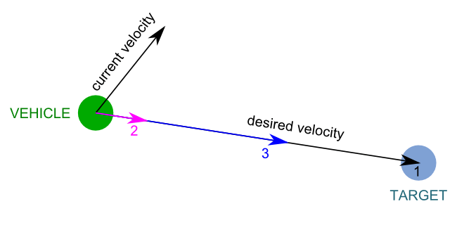
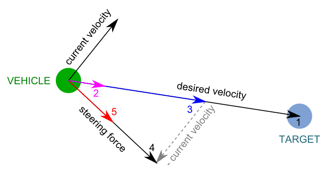
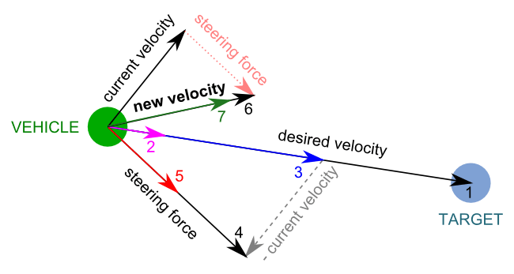
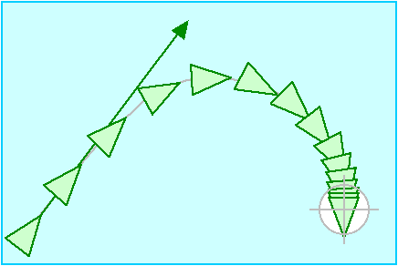

# Intelligence Artificielle - Algorithmie

## Steering Behavior

> Basé sur les ressources :
> https://www.askforgametask.com/tutorial/steering-behaviors-seek/


Ce document propose une implémentation HTML5 du Seek Steering Behavior (Comportement de recherche de direction) dans lequel un véhicule (seeker) se déplace de manière réaliste vers une cible.

Les Steering Behaviors sont des algorithmes d'intelligence artificielle permettant à des agents autonomes de se déplacer de manière réaliste. Ils sont développés par [Craig Reynolds](http://www.red3d.com/cwr/steer/). Plus d'informations sur la théorie derrière ces algorithmes sont disponibles sur son site.

Le premier comportement que l'on va traiter ici est l'algorithme Seek, soit de recherche.


## Démo en ligne

Notre première étape nous amènera au résultat suivant, disponible en ligne :

[Live Demo](https://www.askforgametask.com/html5/tutorials/steer/steer_01_seek.html)


## Problème

On cherche ici à animer un acteur, par exemple un véhicule, de telle sorte à ce que celui-ci se déplace pour rejoindre un point particulier dans l'espace.

Afin de réduire le problème nous nous restreindrons ici à deux dimensions, et nous placerons dans un cas où nous pouvons intéragir immédiatement avec la vitesse de nos objets. A tout moment la position et vitesse de l'ensemble des objets de la simulation peut-être connu.

## Modélisation et pseudo-code

Nous utiliserons ici un véhicule pour représenter notre agent autonome. Dans les schémas suivants, celui-ci est noté "Vehicle", et la cible "Target".
Un véhicule aura une vitesse maximale de déplacement, ainsi qu'une vitesse maximale de changement de direction.

### Etapes 1-3: Calcul de la vitesse désirée

A chaque instant de la simulation nous connaissons la position de notre véhicule ainsi que de sa cible.

Nous pouvons donc connaitre la distance qui sépare notre véhicule de cette cible, ainsi que la direction dans laquelle il nous faudrait se déplacer (en ligne droite !) afin de la rejoindre.

En soustrayant la position du véhicule à celle de notre cible, l'on obtient un vecteur représentant le mouvement que devrait effectuer notre véhicule pour rejoindre sa cible [1].
Si l'on normalise ce vecteur (garder son sens et direction mais ramener sa norme [longueur] à 1), nous obtenons donc la direction à suivre [2].
Il nous reste à multiplier ce dernier vecteur normé par la vitesse maximale de notre véhicule afin d'obtenir la vitesse désirée [3].



> 1. **Vector** (desired velocity) = **Position** (target) – **Position** (vehicle)
> 2. Normalize **Vector** (desired velocity)
> 3. Scale **Vector** (desired velocity) to the *maximum speed*

### Etapes 4-5: Calcul de la force de direction

En plus de connaitre les positions de nos objets, nous connaissons aussi leur vitesses. Notre véhicule lui-même a, à chaque instant, une vitesse courante mesurable (current velocity), avec sa propre direction et intensité.

Les changements d'orientation de notre véhicule sont modelisés par une force de changement de direction, qui nous permet de représenter le comportement de conduite. Notre véhicule possède une valeur maximale pour cette force de changement de direction, qu'il ne devra donc pas pouvoir dépasser.

Conceptuellement, cette force représente le changement de direction que l'on veut voir notre véhicule réaliser.
Nous pouvons donc la calculer comme étant la différence entre la vitesse désirée et la vitesse actuelle [4], puis en limitant l'intensité de ce vecteur à la force maximale du véhicule [5].



> 4. **Vector** (steering force) = **Vector** (desired velocity) – **Vector** (current velocity)
> 5. Limit the magnitude of **Vector** (steering force) to the maximum force

### Etapes 6-7: Calcul de la nouvelle vitesse

Connaissant notre vitesse de déplacement actuelle ainsi que la "force" à appliquer à celle-ci pour s'orienter vers notre vitesse désirée, nous pouvons calculer la nouvelle vitesse instantanée.

Celle-ci est en effet la somme de notre vitesse actuelle ainsi que de la force de changement de direction [6], limitée par la vitesse maximale de notre véhicule [7].



> 6. **Vector** (new velocity) = **Vector** (current velocity) + **Vector** (steering force)
> 7. Limit the magnitude of **Vector** (new velocity) to the maximum speed


## Travail à réaliser

Une base de code vous est fournie, sur laquelle nous allons pouvoir itérer.

Le véhicule sera représenté par une flèche, et la cible par un cercle bleu. A chaque instant la cible est placée sous le curseur de votre souris, et le but de la flèche est donc de la rejoindre.

L'application est très restreinte, son arborescence est la suivante :
- `assets/` 
  --> Images utilisées pour la simulation
- `docs/` 
  --> Cette documentation
- `index.html` 
  --> Fichier html racine à ouvrir dans votre navigateur
- `phaser.min.js` 
  --> Le code réduit de PhaserJS, librairie utilisée pour la simulation
- `script.js` 
  --> Le fichier de script principal de notre application, c'est ici que vous interviendrez principalement

  La version de [PhaserJS](https://phaser.io) utilisée ici est assez ancienne (2.2.9), vous pouvez donc vous baser sur la [documentation de sa version 2](https://phaser.io/docs/2.2.2/index) pour vous aider. Cela tombe bien, c'est la mieux documentée...

### 1. Implémentation de l'algorithme

La version de base du fichier `script.js` vous fournit l'ensemble nécessaire au contexte de notre simulation.

Ouvrez le fichier `index.html` dans votre navigateur ainsi que ce dossier (ou a minima le fichier `script.js`) dans votre éditeur de code.

L'ensemble du système de simulation avec Phaser est déjà mis en place. La fonction `preload` charge les textures de la simulation en mémoire, la fonction `create` prépare la scene en configurant Phaser, créant les acteurs de base et démarrant la simulation physique. Ces deux fonctions sont appelées automatiquement au lancement de notre application Phaser.
Vient ensuite la fonction `update`, qui sera appelée à chaque image ("frame") de notre simulation, et qui nous servira à mettre à jour l'état de l'ensemble de nos acteurs.

C'est dans cette fonction `update` qu'est notamment appelée la fonction `seek`, qui nous intéresse ici.
Le rôle de cette fonction est, partant d'un véhicule et d'une cible, de déterminer la nouvelle vitesse du véhicule pour l'image courante. 
C'est donc bien ici que vient s'insérer notre algorithme de comportement de conduite. La structure de celui-ci a été rappellée en commentaires.

Votre mission, si vous l'acceptez, sera donc d'implémenter cette fonction `seek` à l'aide de notre modélisation et pseudo-code précédents ainsi que des fonctionnalités de PhaserJS. Son squelette est déjà présent.

Une fois fait, vous devriez voir sur votre page la flèche blanche se diriger invariablement vers votre curseur.

> **Infos**
> - Notre véhicule a déjà des propriétés constantes fixées: (pVehicle).MAX_SPEED, MAX_STEER, ainsi que leurs versions "carrées" MAX_SPEED_SQ et MAX_STEER_SQ 
> - Deux arguments sont passés à la fonction `seek`: pVehicle et pTarget, représentant le véhicule et notre cible respectivement. Ces deux objets sont des [Phaser.Sprite](https://phaser.io/docs/2.2.2/Phaser.Sprite.html).
> - Les **Sprite** ont notamment les propriétés interessantes suivantes:
>   - *Spr*.position
>   - *Spr*.body.velocity   (du fait de la simulation physique ajoutée)
> - Ces propriétés sont des [Phaser.Point](https://phaser.io/docs/2.2.2/Phaser.Point.html) (en réalité position est un PIXI.Point, une classe "au dessus" dans la chaîne), et représentent donc des **vecteurs**.
> Javascript ne sachant pas nativement faire des opérations entre des vecteurs, il nous faudra donc utiliser l'API de Phaser et notamment des Phaser.Point afin de réaliser ces calculs.
> Sans plus de détails, la documentation des méthodes suivantes pourra certainement vous orienter :
> <kbd>Point.add</kbd>, <kbd>Point.subtract</kbd>, <kbd>Point.multiply</kbd>, <kbd>Point.normalize</kbd>, <kbd>Point.getMagnitudeSq</kbd>, <kbd>Point.setMagnitude</kbd>
> - Certaines valeurs ont été élevées au carré, en effet, la fonction racine carée étant assez lente, afin de ne pas l'appeller à chaque image une pratique courante est de comparer des vitesses au carré plutôt que des vitesses exactes (mathématiquement, avec a > 0 et b > 0 si a > b alors a² > b²).

### 2. Passage en POO

Nous aimerions maintenant améliorer notre modèle. En effet, arrivé jusqu'ici, notre véhicule suit effectivement bien notre cible et la rejoint comme désiré, mais comme vous pouvez le constater celui-ci ne s'arrête jamais, et oscille sans fin autour de la cible lorsque cette dernière est statique.

La raison est simple, notre véhicule se déplaçant toujours à vitesse maximale, il n'a aucun moyen de ralentir, et cherche donc à inverser sa vitesse à chaque fois qu'il dépasse sa cible.

Pour régler ceci, il nous faut implémenter un comportement supplémentaire, le comportement "d'approche".

Or notre simulation est actuellement codée de manière très impérative. Ca n'a pas été un problème jusqu'ici, mais devient contraignant si l'on veut implémenter des "variations" de notre véhicule.
Nous allons donc dans un premier temps refactorer notre code de façon à utiliser le paradigme Orienté Objet.

#### a. Création de la classe Seeker

Commencons par créer une classe `Seeker`. Jusqu'ici notre seeker est un Sprite, notre classe devra donc étendre la classe `Phaser.Sprite`.

Le seeker est actuellement créé dans la fonction `create`, lignes 39 à 46, et comme vous pouvez le voir c'est assez verbeux :

```js
sprSeeker = game.add.sprite(game.world.centerX, game.world.centerY, 'imgSeeker');
sprSeeker.anchor.setTo(0.5, 0.5);
game.physics.enable(sprSeeker, Phaser.Physics.ARCADE);

sprSeeker.MAX_SPEED = 240;
sprSeeker.MAX_STEER = 6;
sprSeeker.MAX_SPEED_SQ = sprSeeker.MAX_SPEED * sprSeeker.MAX_SPEED;
sprSeeker.MAX_STEER_SQ = sprSeeker.MAX_STEER * sprSeeker.MAX_STEER;
```

Notre but est de transformer ce code de telle sorte à pouvoir instancer un seeker et remplacer le code précédent par une expression plus succincte :

```js
sprSeeker = new Seeker(game, game.world.centerX, game.world.centerY);
```
Et de la même façon, pouvoir remplacer dans la fonction `update`:

```js
seek(sprSeeker, sprTarget);
```

par

```js
sprSeeker.seek(sprTarget);
```

A vous de jouer !

> **Infos**
> - Pensez à appeler le constructeur de Sprite dans votre constructeur de Seeker. Selon les choix de nommages de vos variables, nous pourrions l'appeler comme suit :
> ```js
> /**
>   * game: L'instance de Phaser.Game actuelle
>   * posX: la position horizontale de notre Seeker
>   * posY: la position verticale de notre Seeker
>   * "imgSeeker": Chaîne de charactères fixe représentant le nom associé à la texture choisie pour notre Seeker
>   */
> super(game, posX, posY, "imgSeeker");
> ``` 
> - Un appel à `game.add.sprite()` fait deux chose: créer le sprite, et l'ajouter à `game`. 
> En utilisant la syntaxe `new Seeker`, nous ne faisons qu'instancier la classe Seeker, il nous faut alors ensuite l'ajouter au jeu. Pour ce faire nous pouvons utiliser la méthode `Phaser.Game.add.existing(object: Phaser.DisplayObject)` en lui fournissant notre nouvelle instance comme argument. La solution retenue a été de déclarer une méthode `Seeker.init(game: Phaser.Game)` qui appelera `game.add.existing(this)`, et qui sera elle-même appellée depuis le constructeur de `Seeker`.
> - De multiples solutions sont possibles, mais dans celle retenue nous avons fait le choix de paramétrer nos véhicules (MAX_SPEED, ...) via des propriétés statiques.
> - Au final, la classe Seeker aura donc au minimum l'interface :
> ```js
> interface ISeeker {
>   static VEC_REF: Phaser.Point;
>   static MAX_SPEED: number;
>   //...
>
>   constructor(game: Phaser.Game, posX: number, posY: number): ISeeker;
>   init(game: Phaser.Game): void;
>   seek(pTarget: Phaser.Sprite): void;
> }
> ```
> - Pensez à mettre à jour les fonctions `create` et `update` !

#### b. Refactoring de la méthode `seek`

Nous venons de créer une classe Seeker dans l'idée de pouvoir ensuite facilement créer des variations de celle-ci. En POO, des "variations de classes" sont souvent implémentées par le mécanisme d'héritage dans lequel des classes enfants vont étendre une classe parent.

De l'ensemble des méthodes implémentées pour notre classe Seeker, c'est ici la fonction `seek` qui est responsable du Seek Behavior utilisé. Ce sont ultimement des variations de ce comportement précis que nous cherchons à créer. Naïvement, c'est donc l'ensemble de la fonction `seek` qui serait successivement remplacée (`override`) par nos futures classes enfant.

Actuellement, le comportement de suivi est donc implémenté en un seul gros bloc représenté par la méthode `seek`. Si l'on y regarde bien, celle-ci a en réalité de multiples responsabilités.
On peut actuellement dériver son comportement en quatre étapes :
- Calcul de la vitesse désirée
- Calcul de la vitesse de changement de direction
- Mise à jour de la vitesse actuelle
- Mise à jour de la rotation du véhicule

Chacune de ces étapes représente une responsabilité différente, et il serait intéressant de pouvoir les modifier individuellement.
De façon à pouvoir étendre plus finement notre classe `Seeker` et notamment son comportement de suivi, nous allons donc refactorer (changer l'expression sans changer le comportement) la méthode `seek`.
Comme nous souhaitons pouvoir modifier ces quatre responsabilités indépendamment les une des autres, tout en minimisant la duplication de code, nous allons extraire ces quatres "blocs" de code de la fonction `seek` pour les remplacer par des fonctions respectives.

L'idée est donc de passer de ceci :

```js
class MyClass {

    doEverything(){
        // First, do something
        /** Code that does something **/

        // Then, do something else
        /** Code that does something else **/

        // Finally, do this last thing
        /** Code that does this last thing **/
    }

}
```

à ceci :

```js
class MyClass {

    doEverything(){
        this.doSomething();

        this.doSomethingElse();

        this.doThisLastThing();
    }

    doSomething(){
        /** Code that does something **/
    }

    doSomethingElse(){
        /** Code that does something else **/
    }

    doThisLastThing(){
        /** Code that does this last thing **/
    }

}
```

> **Note**
> Ce procédé est très courant en POO, et amène à créer plus de fonctions mais dont les responsabilités sont mieux découpées, chacune d'entre-elle se retrouvant alors plus courte et moins complexe. C'est le plus souvent considéré bonne pratique (ça ne doit pas non plus devenir une fin en soit, le but final reste la qualité et maintenabilité du code).


Suite à ce refactoring, notre classe Seeker devrait avoir une interface semblable à celle-ci :
 ```js
 interface ISeeker {
   static VEC_REF: Phaser.Point;
   static MAX_SPEED: number;
   //...

   constructor(game: Phaser.Game, posX: number, posY: number): ISeeker;
   init(game: Phaser.Game): void;
   seek(pTarget: Phaser.Sprite): void;

   getDesiredVelocity(pTarget: Phaser.Sprite): Phaser.Point;
   getSteeringForce(vecDesired: Phaser.Point): Phaser.Point;
   setNewVelocity(newVelocity: Phaser.Point): void;
   lookAhead(): void;
 }
 ```


### 3. Comportement d'approche simple

Nous sommes maintenant prêts à améliorer notre comportement de suivi. 

Pour rappel, notre problème est qu'actuellement, le véhicule ne s'arrête jamais et oscille sans fin autour de la cible. La raison est simple: quelle que soit la position de notre véhicule nous lui imposons toujours de se déplacer à sa vitesse maximale. Même infiniment près de la cible il se dirigera vers celle-ci à vitesse maximale, la dépassant inévitablement.

En fait, notre véhicule a actuellement bien un comportement de suivi (Seek Behavior) mais pas de comportement d'approche (Arrival Behavior). 
Nous allons donc modifier le calcul de la vitesse désirée pour prendre en compte la distance séparant le véhicule de sa cible.

Une première approche simple serait de continuer à baser la vitesse de notre véhicule sur la distance qui le sépare de la cible [1], mais ensuite de simplement limiter l'intensité du vecteur vitesse désirée à notre MAX_SPEED, plutôt que de le normaliser ([2]) et lui imposer cette même intensité ([3]).

On passe donc de :

> 1. **Vector** (desired velocity) = **Position** (target) – **Position** (vehicle)
> 2. Normalize **Vector** (desired velocity)
> 3. Scale **Vector** (desired velocity) to the *maximum speed*

à :

> 1. **Vector** (desired velocity) = **Position** (target) – **Position** (vehicle)
> 2bis. Limit the magnitude of **Vector** (desired velocity) to the *maximum speed*

De cette façon, plus le véhicule sera proche de la cible, plus sa vitesse sera réduite, et il aura donc une chance de s'arrêter.

Votre travail sera donc d'implémenter ce nouveau comportement, en dérivant une classe `ApproachingSeekerSimple` étendant la classe `Seeker` et dans laquelle il nous suffira de redéclarer la fonction `getDesiredVelocity()`.

> **Infos**
> - Pensez à mettre à jour les fonctions `create` et `update`. 

### 4. Comparer

Si tout s'est bien passé, nous avons maintenant deux classes implémentant le comportement de conduite, dont une ayant aussi un comportement d'approche.
Il serait appréciable maintenant de pouvoir comparer ces deux classes simultanément.

Pour ce faire, il nous suffit fondamentalement de créer une instance de chacune de ces classes dans notre fonction `create`, puis appeler leurs méthodes `seek` respectives depuis la fonction `update`.

Afin de pouvoir mieux distinguer nos différents acteurs, nous allons utiliser une astuce proposée par PhaserJS. Actuellement, chacun de nos vehicules est représenté par une flêche blanche. Nous pourrions choisir d'utiliser différentes textures pour chacun d'entre eux, mais ceci nous demanderait de réaliser (ou collecter) ces mêmes textures, et s'ajouteraient alors à la charge des ressources nécéssaires à notre application.

Une solution plus optimisée serait de simplement attribuer différentes couleurs à nos véhicules pour les distinguer. Là aussi ceci pourrait être réalisé avec de multiples textures et leurs couleurs associées, mais l'on retomberait dans la problématique précédente.
Une solution proposée par PhaserJS est de pouvoir appliquer dynamiquement une teinte aux entités de type `Phaser.Sprite`. C'est d'ailleurs la raison pour laquelle nous avons choisi une flèche blanche jusqu'ici: le blanc étant représenté (en RGB) par une quantité maximale de rouge, de vert et de bleu, c'est la couleur la plus facile à teinter.

Chaque `Phaser.Sprite` a une propriété `tint`, valeur numérique exprimée en hexadécimal. Dans l'exemple suivant, nous créons un sprite puis teintons sa texture en rouge (#ff0000);

```js
const sprite = new Phaser.Sprite(/* ... */);
sprite.tint = 0xff0000;
```

Plusieurs implémentations sont possibles pour tirer partie de cette idée dans notre programme. La solution choisie ici a été de modifier le constructeur de notre classe `Seeker` pour lui ajouter un argument color, et réassigner `this.tint` depuis ce même constructeur. Par empathie avec nos futurs nous-même, cet argument `color` a été défini comme optionnel avec une valeur par défaut à `0xffffff`, ce qui effectivement signifie "aucune teinte".

Réalisez ces changements dans votre code, puis instancer un véhicule de chaque classe avec une couleur différente depuis la fonction `create`.
Ceci vous permettra de mieux distinguer les deux véhicules et leurs comportements associés.

### 5. Comportement d'approche amélioré

Maintenant que nous avons de bonne méthodologies pour créer différentes variations de nos véhicules ainsi que pour les distinguer facilement, nous avons le champ libre pour expérimenter.

Entre autres, notre comportement d'approche pourrait être un peu amélioré: a bien regarder le comportement du véhicule, celui-ci commence à ralentir très tôt, et peut donc mettre un certain temps à rejoindre la cible.

Ceci se comprend bien: nous prenons maintenant bien en compte la distance par rapport à la cible, mais nous nous y référons constamment, même lorsque celle-ci est relativement grande.

Pour palier à cela, l'algorithme d'approche utilisé par Reynolds est un tout petit peu plus poussé que notre algorithme actuel. Il rajoute en effet une variable, représentant la distance minimale pour laquelle le véhicule commence à ralentir.
Cette distance minimale peut être conceptualisée comme un cercle autour de la cible, *hors* duquel notre véhicule avance à MAX_SPEED, et *dans* lequel sa vitesse diminue linéairement avec la distance à la cible.

> **Arrival Behavior**
>  
> Arrival behavior is identical to seek while the character is far from its target. But instead of moving through the target at full speed, this behavior causes the character to slow down as it approaches the target, eventually slowing to a stop coincident with the target, as shown in Figure 6. The distance at which slowing begins is a parameter of the behavior. This implementation is similar to seek: a desired velocity is determined pointing from the character towards the target. Outside the stopping radius this desired velocity is clipped to max_speed, inside the stopping radius, desired velocity is ramped down (e.g. linearly) to zero.
> ```pseudo
>    target_offset = target - position
>    distance = length (target_offset)
>    ramped_speed = max_speed * (distance / slowing_distance)
>    clipped_speed = minimum (ramped_speed, max_speed)
>    desired_velocity = (clipped_speed / distance) * target_offset
>    steering = desired_velocity - velocity
>```
> Real world examples of this behavior include a baseball player running to, and then stopping at a base; or an automobile driving towards an intersection and coming to a stop at a traffic light.
> 
> -- [Steering Behaviors For Autonomous Characters](http://www.red3d.com/cwr/steer/gdc99/), Craig W. Reynolds


En se basant sur ces informations, créer une classe `ApproachingSeeker` basée sur `Seeker` et utilisant cette troisième version de l'algorithme de comportement. Dans la solution proposée, le choix a été fait de stocker la distance minimale dans une variable statique `ApproachingSeeker.SLOWING_DISTANCE_THRESHOLD`, mais d'autres solutions sont possibles.

Comparez ensuite le comportement de vos trois agents différents.
Identifiez les avantages de la POO pour ce type de développement.
Enfin, expérimentez !


> **Infos**
> Nous n'avons ici qu'éffleuré les comportements de conduite des agents autonomes.
> Bien d'autres comportements ont été implémentés :
> Poursuite, évasion, évitement d'obstacles, suivi de chemin, ...
>
> [Steering Behaviors For Autonomous Characters](http://www.red3d.com/cwr/steer/gdc99/), Craig W. Reynolds
> [De nombreuses autres ressources sur ce même site](http://www.red3d.com/cwr/steer/)
> [OpenSteer (Bibliothèque C++)](http://opensteer.sourceforge.net/)